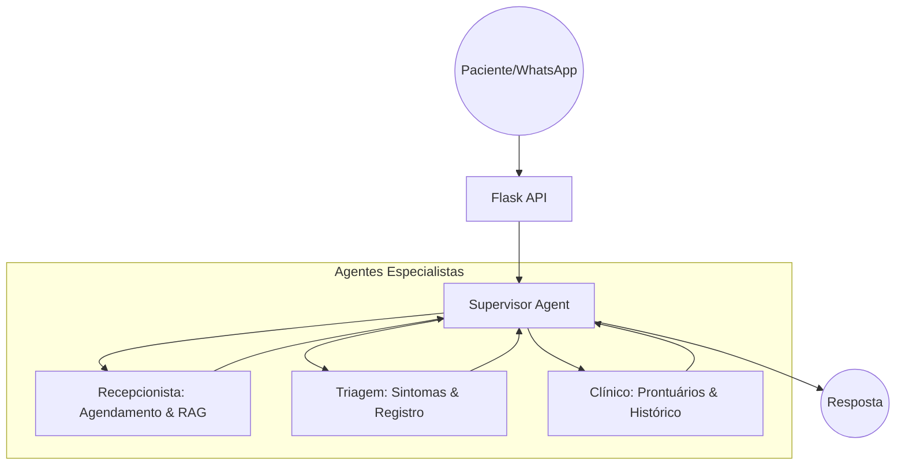

# 🏥 Oclus Health Assistant

Assistente de IA Multiagente de alta performance para clínicas de saúde, construído com **LangChain 0.3**, **LangGraph** e **OpenAI**. O sistema integra WhatsApp (via WAHA) para automação de agendamentos, triagem clínica e prontuários estruturados.

## 🌟 Diferenciais
- **Orquestração Multiagente**: Supervisor inteligente que delega tarefas para agentes especialistas (Recepcionista, Triagem, Clínico).
- **Multimodalidade Real**: Processa mensagens de texto, áudios (transcrição via Whisper) e imagens/exames (análise via GPT-4o Vision).
- **RAG (Retrieval-Augmented Generation)**: Consulta manuais de regras da clínica, preços e procedimentos em PDF/TXT via ChromaDB.
- **Dashboard Administrativo**: Interface para gestão de consultas, assinatura de prontuários SOAP e upload de documentos.
- **Arquitetura Moderna**: Baseado em LangGraph para fluxos de estado cíclicos e persistentes.

## 🤖 Arquitetura do Sistema (Multi-Agent Flow)



## 🚀 Funcionalidades Principais

### 1. Atendimento e Agendamento (Agente Recepcionista)
- Verificação de disponibilidade em tempo real.
- Agendamento, cancelamento e reagendamento de consultas.
- Respostas sobre convênios, preços e regras da clínica (via RAG).

### 2. Triagem Inteligente (Agente de Triagem)
- Coleta empática de sintomas antes da consulta.
- Identificação de sinais de alerta e urgências.
- Registro automático do resumo da triagem para o médico.

### 3. Gestão Clínica (Agente Clínico)
- Geração de prontuários no padrão **SOAP** (Subjetivo, Objetivo, Avaliação, Plano).
- Consulta de histórico médico completo do paciente.
- Analytics de satisfação (NPS) e feedbacks.

### 4. Multimodalidade
- **Áudio**: Pacientes podem enviar áudios que são automaticamente transcritos e processados.
- **Imagens**: Envio de fotos de exames ou pedidos médicos para extração de dados via Vision AI.

## 🛠️ Stack Tecnológica

- **Framework de IA**: LangChain 0.3, LangGraph 0.2
- **Modelos**: GPT-4o, GPT-4o-mini, Whisper-1 (OpenAI)
- **Banco de Dados**: Supabase (PostgreSQL)
- **Vector Store**: ChromaDB
- **Backend**: Flask (Python 3.10+)
- **Integração**: WAHA (WhatsApp HTTP API)
- **Infraestrutura**: Docker & Docker Compose

## 📦 Estrutura do Projeto

```text
oclus_health/
├── app/
│   ├── agents/             # Lógica Multiagente (Supervisor + Specialists)
│   │   ├── agent.py        # Orquestração LangGraph
│   │   ├── tools.py        # Ferramentas de negócio (CRUD, Agendamento)
│   │   └── rag.py          # Implementação de busca semântica
│   ├── api/                # Rotas Flask e Webhooks
│   ├── core/               # Conexão DB e Schedulers
│   ├── services/           # Integração WAHA (WhatsApp)
│   ├── static/             # Dashboard Administrativo (Frontend)
│   └── utils/              # Processamento de Mídia (OCR/Whisper)
├── docker-compose.yml      # Orquestração WAHA + API
└── requirements.txt        # Dependências Modernas
```

## 🔧 Instalação e Configuração

### Pré-requisitos
- Docker e Docker Compose
- Chave de API da OpenAI
- Conta no Supabase

### 1. Configurar Variáveis de Ambiente
Crie um arquivo `.env` na raiz do projeto:

```env
# OpenAI
OPENAI_API_KEY=sk-...

# Supabase
SUPABASE_URL=https://your-project.supabase.co
SUPABASE_SERVICE_ROLE_KEY=your-key

# WhatsApp (WAHA)
WHATSAPP_API_URL=http://localhost:3000
WHATSAPP_API_KEY=krb245ib24on2i12v5i12p5kn14i51o24ib5o24h5ov

# Admin
ADMIN_API_TOKEN=oclus-admin-secret-123
```

### 2. Executar com Docker
O projeto já inclui o serviço WAHA e a API:

```bash
docker-compose up -d
```

### 3. Execução Local (Desenvolvimento)
Se preferir rodar apenas a API localmente:

```bash
python -m venv venv
source venv/bin/activate  # Windows: venv\Scripts\activate
pip install -r requirements.txt
python -m app.api.routes
```

## 🖥️ Dashboard Administrativo
Acesse em: `http://localhost:3001/admin`
- **Funcionalidades**: Visualizar agenda do dia, assinar notas SOAP pendentes e gerenciar documentos do RAG.
- **Autenticação**: Requer o `X-Admin-Token` configurado no `.env`.

## 🔐 Segurança e Compliance
- **LGPD**: Dados sensíveis de saúde são tratados com isolamento de sessão.
- **Auditoria**: Todas as ações dos agentes são registradas no Supabase.

## 📞 Suporte e Contato
Desenvolvido por Oclus Health. Para suporte técnico, entre em contato com a equipe de engenharia.
